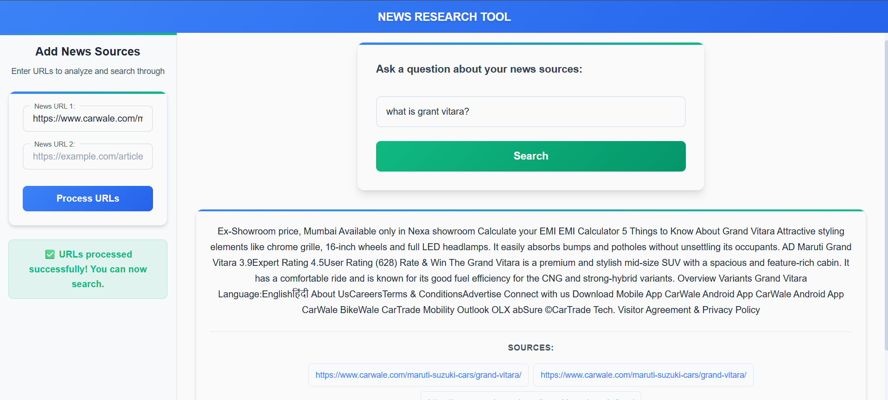

# 🤖 AI-Powered News Research Tool

[](https://www.python.org/)
[](https://fastapi.tiangolo.com/)
[](https://reactjs.org/)
[](https://github.com/topics/artificial-intelligence)
[](https://langchain.com/)
[](https://faiss.ai/)

> **Full-Stack AI Application** - A sophisticated news analysis platform combining modern web technologies with cutting-edge AI/ML capabilities for intelligent document processing and question answering.

An AI-powered tool that helps users analyze news articles and get intelligent answers to their questions with source attribution. This project demonstrates advanced AI/ML integration, vector search capabilities, and full-stack development skills.

## 📸 Screenshots



## 🌟 Features

### 🤖 AI/ML Capabilities
- **Advanced Document Processing**: Intelligent URL content extraction and semantic chunking
- **Vector Similarity Search**: High-performance semantic search using Pinecone
- **LLM-Powered Q&A**: Context-aware answers using Groq's Llama 3.3 70B model
- **Semantic Embeddings**: State-of-the-art sentence transformers for text understanding
- **Source Attribution**: Intelligent tracking and display of information sources

### 🎯 User Experience
- **Real-time Processing**: Immediate feedback with intelligent loading states
- **Responsive Design**: Seamless experience across desktop and mobile devices
- **Intuitive Interface**: Clean, modern UI for complex AI operations

## 🏗️ Architecture & Complexity

This project demonstrates **full-stack AI/ML development** with sophisticated architecture:

### 🔧 System Architecture
- **Microservices Design**: Separate frontend and backend services
- **AI Pipeline**: Document processing → Embedding → Vector storage → Retrieval → LLM generation
- **Async Processing**: Non-blocking operations for better user experience
- **Scalable Vector Search**: Pinecone integration for production-ready similarity search

### 📊 Technical Complexity
- **Document Processing**: Advanced text chunking with semantic overlap
- **Vector Operations**: High-dimensional embedding space management
- **LLM Integration**: Complex prompt engineering and context management
- **Real-time Search**: Sub-second response times for AI-powered queries

## 🛠️ Tech Stack

### Frontend (Modern Web Technologies)
- **React 18.3.1** - Latest React with concurrent features
- **Vite** - Ultra-fast build tool and dev server
- **Axios** - Robust HTTP client for API communication
- **Modern CSS** - Responsive design with loading states and animations

### Backend (AI/ML Core)
- **FastAPI** - Modern async web framework
- **LangChain** - Advanced LLM orchestration and document processing
- **Pinecone Vector Database** - High-performance vector similarity search
- **Groq LLM Integration** - Ultra-fast inference with Llama 3.3 70B model
- **HuggingFace Embeddings** - State-of-the-art sentence transformers (all-mpnet-base-v2)
- **Document Processing Pipeline** - Intelligent text chunking and semantic indexing


# News Research Tool - Flow Points 📋

### 1. Initial URL Processing 📥
User inputs URLs in left panel
Frontend sends URLs to /api/process_url endpoint
Backend receives URLs for processing
   - Context retrieval
   - LLM-powered answer generation
   - Source attribution


### 2. Document Processing Pipeline 📄
```python
# Key Steps:
1. URL Content Extraction (UnstructuredURLLoader)
2. Text Splitting (RecursiveCharacterTextSplitter)
   - Chunk size: 300 characters
   - Overlap: 50 characters
3. Embedding Generation (HuggingFace)
4. Vector Storage (FAISS)
5. Save to disk for later use
```


### 3. Question Processing Pipeline 🔍
```python
# Flow:
1. User submits question
2. Load vector store
3. Retrieve relevant context
4. Generate answer using LLM
5. Return answer with sources
```


### 4. Key Components 🛠️
```
Frontend:
- React components (Main.jsx, Menubar.jsx)
- Axios for API calls
- Loading states
- Error handling

Backend:
- FastAPI endpoints
- LangChain integration
- Groq LLM
- FAISS vector store
```


### 5. Data Flow Steps 📊
```
1. Document Flow:
   URL → Text → Chunks → Embeddings → Storage

2. Query Flow:
   Question → Vector Search → Context → LLM → Response
```

### 6. User Interface Flow 👤
```
1. Left Panel:
   - URL input fields
   - Process button
   - Processing status

2. Right Panel:
   - Question input
   - Answer display
   - Source attribution
   - Loading indicators
```


